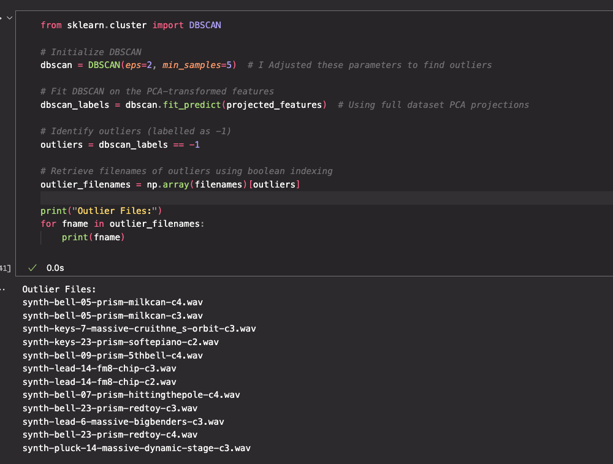

# Notable changes

First, from reccomendation, i removed the RMS. This highly improved the quality of the dataset, and the graph for finding an elbow became must clearer. It now seemed to lay around 3 or 4.
I scanned for outliers and removed the files included in the picture below.

It became clear that 3 was the proper amount of clusters, as listening to 4 clusters had alot of overlaps.
I listened through the clusters and wrote down my observations for each cluster.
